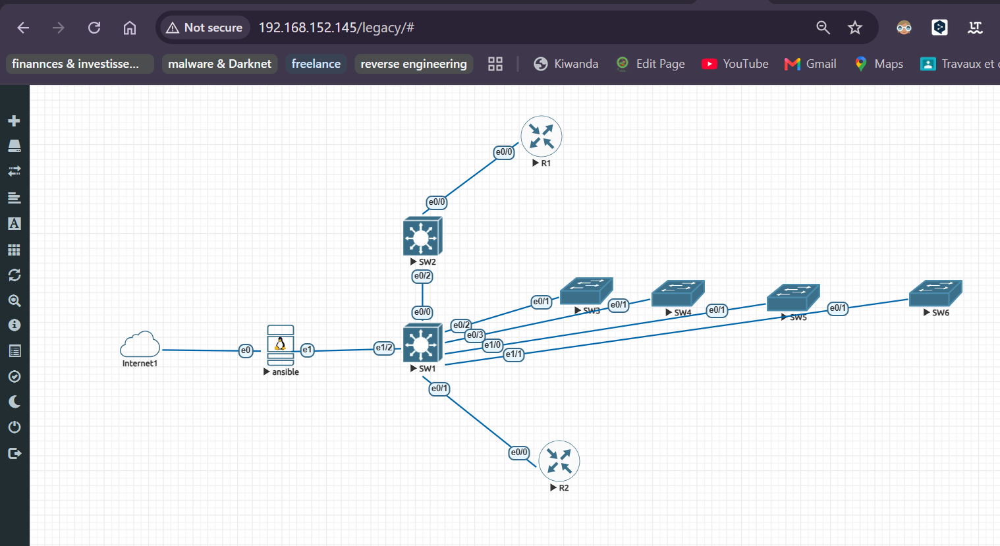

# ANSIBLE ET LES EQUIPEMENTS RESEAU (SWITCH & ROUTEUR CISCO)

**Objectif :** Ce projet a pour but d'automatiser les configurations sur des équipements réseau (switch et routeur cisco). 

### I- PREREQUIS
Afin de reproductuire ce travail, il est important que vous ayez les éléments suivants sur votre os (Ubuntu Desktop/dans mon cas):
- Eveng (Dans la mesure où vous voulez faire de la virtualisation mais vous pourez appliquer les même configuration sur vos équipements physique);

- ansible-pylibssh 

### III- CONFIGURATION

  

